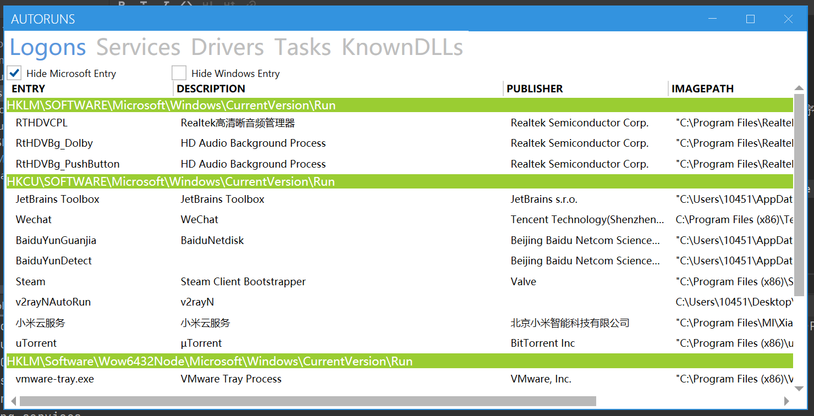
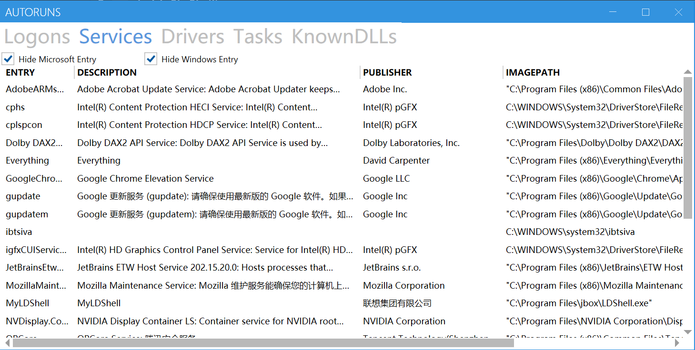
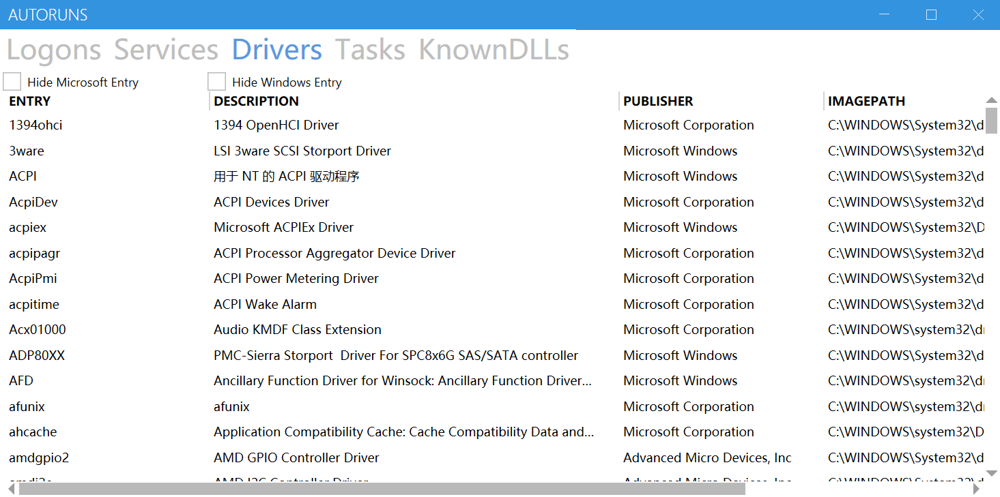
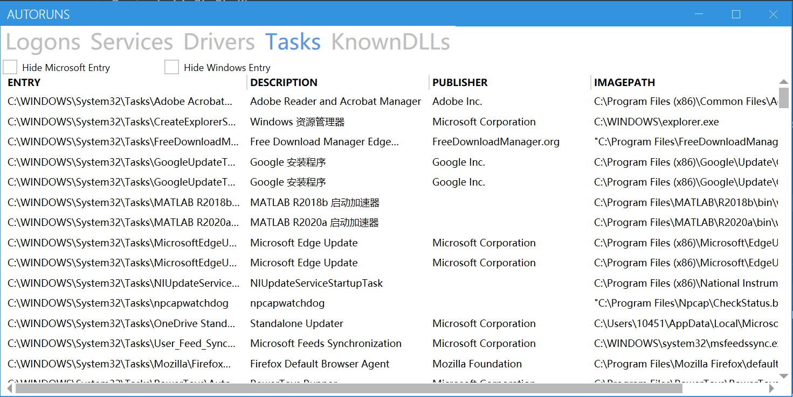
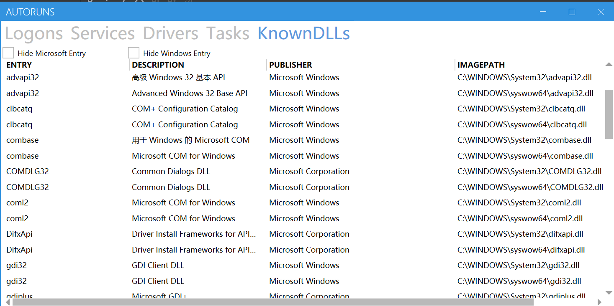

# AutoRuns
SJTU IS405《Windows安全原理与技术》课程大作业。

## 介绍
参考 [Sysinternals](https://docs.microsoft.com/en-us/sysinternals/) 工具集中的 [Autoruns](https://docs.microsoft.com/en-us/sysinternals/downloads/autoruns) ,实现对 Windows 的自启动项的查看和分析。

本项目包含的自启动种类如下：

- [x] Logon 启动目录， 注册表启动
 
- [x] Services 系统服务
 
- [x] Drivers 系统驱动服务
 
- [x] Scheduled Tasks 计划任务
 
- [x] Known DLLs 知名动态链接库

尚未包含的自启动种类有：

- [ ] Internet Explorer IE 浏览器的 BHO 对象
 
- [ ] Boot Execute 启动执行
 
- [ ] Image Hijacks 映像劫持

- [ ] Winsock Providers Winsock 服务提供程序
 
- [ ] Winlogon 用户登录通知程序
 
-[ ] ...

本项目实现语言为`C#`，所用框架为`.NET Core v3.1`。

## 截图
### Logons

### Services

### Drivers

### Scheduled Tasks

### Known DLLs
